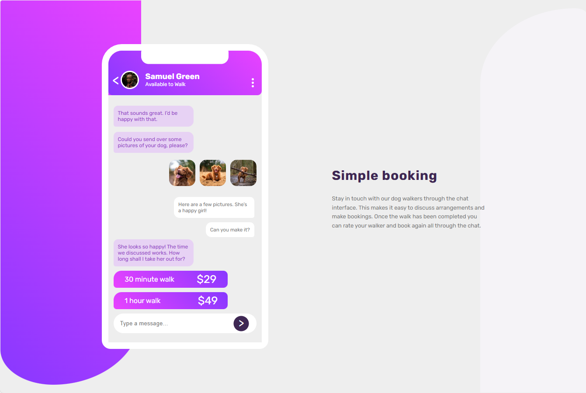

# Frontend Mentor - Chat app CSS illustration

This is a solution to the [Chat app CSS illustration](https://www.frontendmentor.io/challenges/chat-app-css-illustration-O5auMkFqY). Frontend Mentor challenges help you improve your coding skills by building realistic projects.

## Table of contents

- [Overview](#overview)
  - [The challenge](#the-challenge)
  - [Screenshot](#screenshot)
  - [Links](#links)
- [My process](#my-process)
  - [Built with](#built-with)
  - [What I learned](#what-i-learned)
  - [Continued development](#continued-development)
- [Author](#author)
- [Acknowledgments](#Acknowledgments)

## Overview

### The challenge

In this challenge, you'll be building out the entire app illustration from scratch. This will seriously test your CSS skills. So give it a go if you feel confident!

Your users should be able to:

- View the optimal layout for the component depending on their device's screen size

### Screenshot



### Links

- Solution URL: [here](https://github.com/olahasan/HTML_AND_CSS_Frontend-Mentor_INTERMEDIATE-Chat-app-CSS-illustration)

- Live Site URL: [here](https://olahasan.github.io/HTML_AND_CSS_Frontend-Mentor_INTERMEDIATE-Chat-app-CSS-illustration/)

## My process

### Built with

- Semantic HTML5 markup
- CSS custom properties
- Flexbox
- CSS Grid
- Mobile-first workflow

### What I Learned

In this project, I learned how to effectively use CSS custom properties and gradients to create visually appealing designs. I also improved my skills in responsive design using media queries.

```css
:root {
  --Pale-Violet: hsl(276, 100%, 81%);
  --Moderate-Violet: hsl(276, 55%, 52%);
  --Desaturated-Dark-Violet: hsl(271, 15%, 43%);
  --Grayish-Blue: hsl(206, 6%, 79%);
  --Very-Dark-Desaturated-Violet: hsl(271, 36%, 24%);
  --Dark-Grayish-Violet: hsl(270, 7%, 64%);
}
```

### Continued Development

I plan to continue improving my CSS skills, focusing on advanced layout techniques and animations. I also want to explore more about accessibility and how to make my projects more accessible to all users.

### Author

Frontend Mentor - @olahasan<br>
GitHub - @olahasan

### Acknowledgments

Thanks to **Frontend Mentor** for providing this challenge and to the community for their support and feedback
